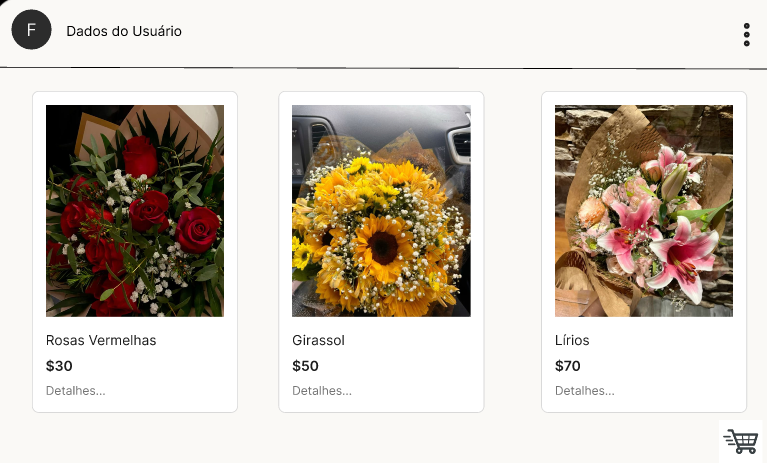

# Portfólio de Beatriz Gabrielle Vizeu de Salles

Bem-vindo ao meu portfólio! Aqui você encontrará informações sobre mim, o que estou aprendendo, os projetos que desenvolvi e detalhes sobre o meu TCC. Este repositório contém o código do meu site pessoal, criado para demonstrar meu aprendizado e experiência no curso de Tecnologia da Informação no SENAI.

## Índice

- [Sobre Mim](#sobre-mim)
- [Aprendendo Sobre](#aprendendo-sobre)
- [Projetos](#projetos)
  - [Projeto 1: Tela de Cadastro para Clínica Médica](#projeto-1-tela-de-cadastro-para-clínica-médica)
  - [Projeto 2: Site de Loja de Roupas](#projeto-2-site-de-loja-de-roupas)
  - [Projeto 3: Página de Cadastro de Escola](#projeto-3-página-de-cadastro-de-escola)
- [TCC](#tcc)
- [Contato](#contato)

## Sobre Mim

Meu nome é Beatriz Gabrielle Vizeu de Salles, tenho 16 anos e estou no 3° Ano do Ensino Médio. Atualmente, estou cursando T.I. no SENAI, mas meu plano futuro é seguir a área de Medicina. A tecnologia me encanta, e este portfólio reflete o conhecimento adquirido ao longo do curso de T.I.

## Aprendendo Sobre

Atualmente, estou aprendendo as seguintes tecnologias:

- **HTML**
- **CSS**
- **JavaScript**
- **SQL**

Essas são as linguagens que estou estudando e aplicando em projetos práticos.

## Projetos

### Projeto 1: Tela de Cadastro para Clínica Médica

Este projeto foi realizado como parte do exercício de PBE1, onde simulei a criação de uma tela de cadastro para uma clínica médica. O objetivo era criar uma interface simples e funcional para o cadastro de pacientes e médicos.

### Projeto 2: Site de Loja de Roupas

Neste projeto, desenvolvi um site modelo para uma loja de roupas. A página exibe produtos, incluindo nome, descrição e preço, com um layout simples e eficiente.

### Projeto 3: Página de Cadastro de Escola

Esse projeto é uma página de cadastro para uma escola, onde os dados dos alunos, professores, turmas e disciplinas são organizados. Ele foi desenvolvido para aplicar os conceitos de criação de sistemas com base em banco de dados.

## TCC

O tema do meu TCC é a **floricultura**, com foco no desenvolvimento de um sistema para ajudar uma floricultura a organizar e classificar suas plantas. O objetivo é criar uma solução que permita identificar e organizar as plantas com informações como nome, espécie, classificação botânica e imagem ilustrativa.

A ideia é melhorar a eficiência operacional da loja e proporcionar um atendimento mais rápido e preciso aos clientes.

## Contato

Se você quiser entrar em contato comigo, pode usar as informações abaixo:

- **E-mail**: [bia.vizeu.salles@gmail.com](mailto:bia.vizeu.salles@gmail.com)
- **GitHub**: [Bia-Vizeu](https://github.com/Bia-Vizeu)

© 2025 Beatriz Vizeu. Todos os direitos reservados.
